Vineyard segmenter using high resolution images (25cm/px)
===============================================================

# Objective

The aim of this project is to train a semantic segmentation model that can detect vineyards in high-resolution aerial
images of 25cm from spanish [Plan Nacional de Ortofotografía Aérea (PNOA)](https://pnoa.ign.es/) project. To achieve
this, you will use a dataset of labeled images that includes both vineyard images and other types of crops and terrains.
Once the model is trained, it will be applied to the raster using window sliding to obtain a mask with the probabilities
of vineyard usage in the patch. After this, the masks will be vectorized to obtain a shapefile, that will be filtered
and simplified.

**This is just a prototype.**

# Dataset

* High resolution aerial images (25cm/px) from
  spanish [Plan Nacional de Ortofotografía Aérea (PNOA)](https://pnoa.ign.es/), a restricted área from the region of
  Castilla y León is used in this project to train the classifier. The images for year 2020 in the area of Castilla y
  León can be accessed [here](http://ftp.itacyl.es/cartografia/01_Ortofotografia/2020/).
* LPIS: Land parcel Information System, feature files containing parcels in the area of the images, these features are
  used to manually select the parcels with vineyeard usage to extract patches for each category (0-no vineyard
  1-vineyard). These files can be downloaded for the area of Castilla y León
  from [here](http://ftp.itacyl.es/cartografia/05_SIGPAC/2020_ETRS89/Parcelario_SIGPAC_CyL_Municipios/).

The input image size of the Unet is 256x256x3. To make sure avery detail

### Iteration v1
Iteration 1, Unet Trained for 50 epochs using just 500 images with at least a 30% of each category. loss(
categorical_crossentropy)?=0.0378 val_mean_iou=0.938 Lets add more samples iwth images with just 0 category

- Model is performing suprisely well
- Trees have been unrepresented and crops with linear marks produced by tractor tracks. Add these images as 0-categories
  and create dataset v2

### Iteration v2
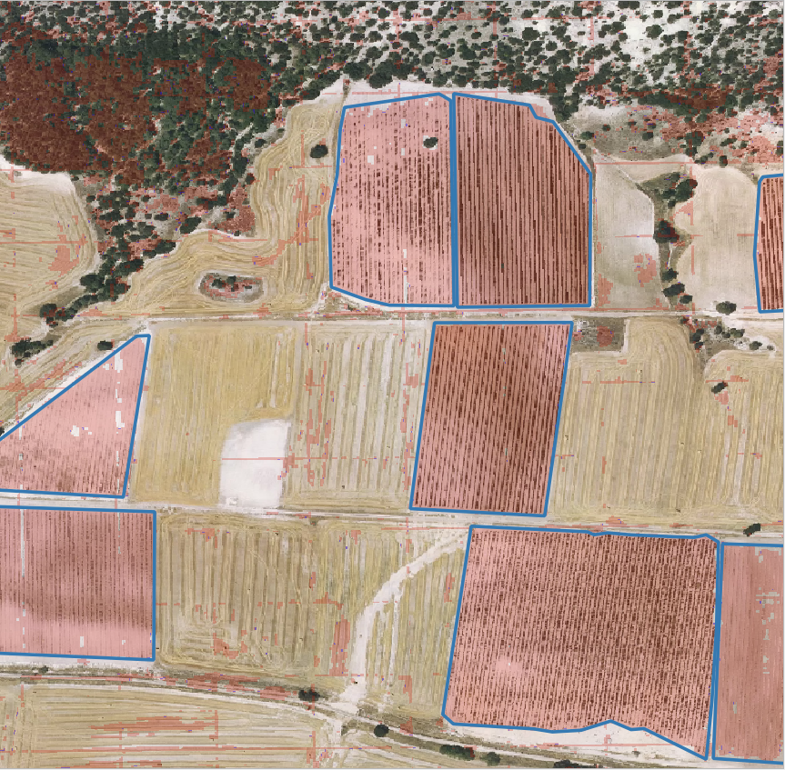

- Se ha añadido al dataset ejemplos totalmente positivos y totalmente negativos para represnetar zonas de cultivo y
  árboles. Los resultados bastante buenos, es ha aplicado el modelo en zonas no utilizadas para crear el dataset
  original y es capaz de segmentar el viñedo. Además mejora significativamente la predicción en las zonas en las que no hay presentación de viñedo.

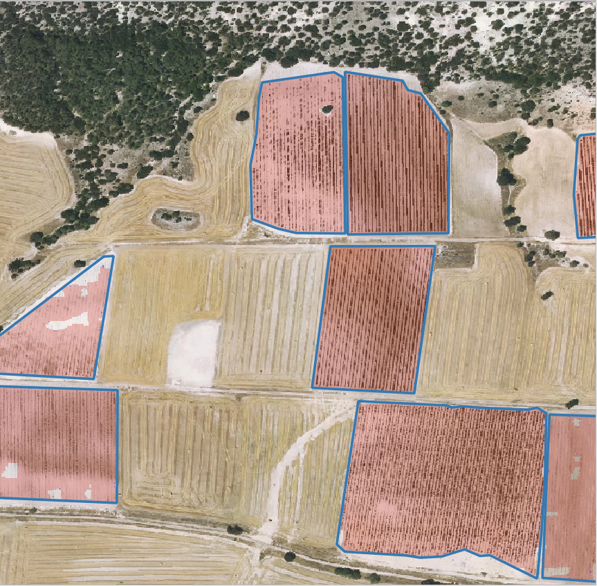

- Si embargo tiene problemas en detectar tipos de viñedo no vistos, se han detectado tres problemas:
  - Viñedos con poca cobertura vegetal
  - Viñedos con estructrua poco regular, por ejemplo con sistemas de conducción diferenes a la espaldera.
  - Zonas con árboles y frutales 
  - Viñedos con terreno más oscuro. 

| 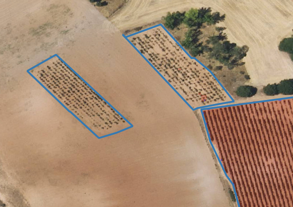 | 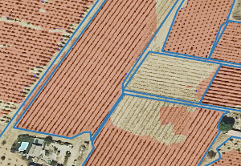 | 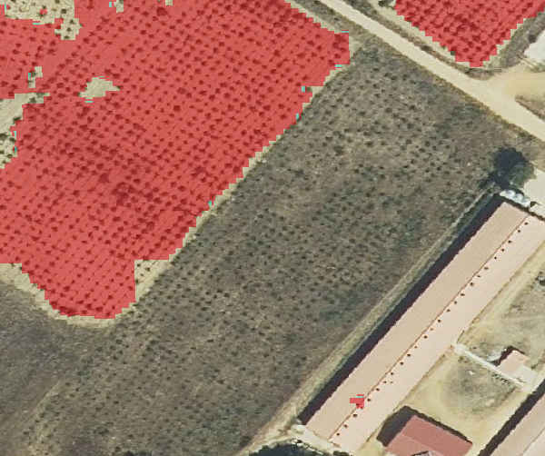 |

Para la tercera iteración se va a crear un dataset utilizando nuevos ejemplos de estas zonas y se va a re-entrenar el modelo existente. 
### Iteration v3

Creando un nuevo dataset que incluye las zonas no representadas mejora significativamente las prestaciones del modelo:

| 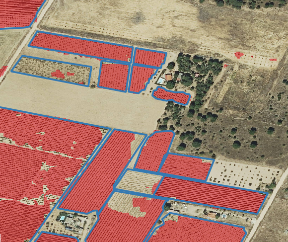 | 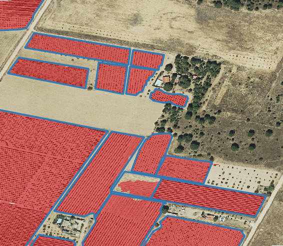 |
|-----|-----|
| 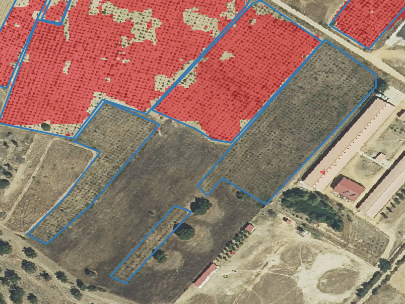 | 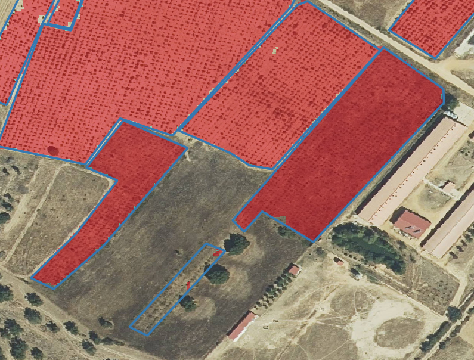 |
| 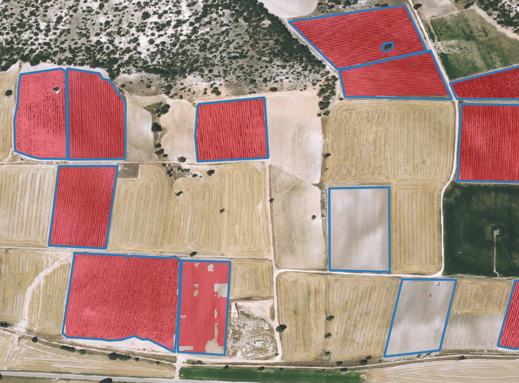 | 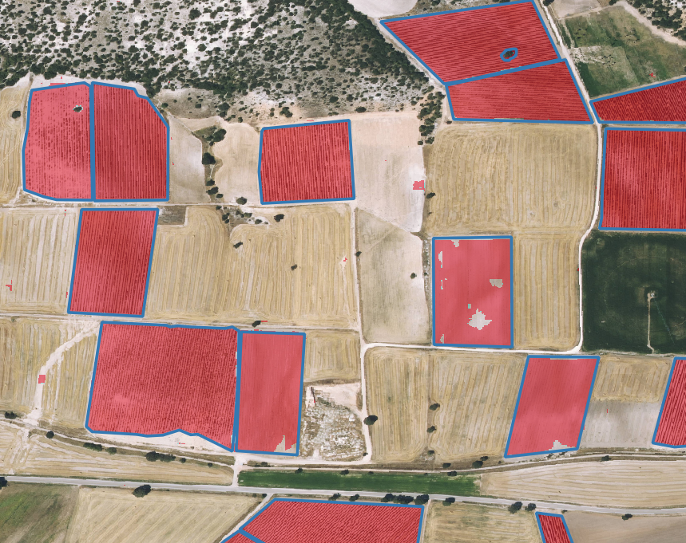 |

# References
@article{akeret2017radio,
  title={Radio frequency interference mitigation using deep convolutional neural networks},
  author={Akeret, Joel and Chang, Chihway and Lucchi, Aurelien and Refregier, Alexandre},
  journal={Astronomy and Computing},
  volume={18},
  pages={35--39},
  year={2017},
  publisher={Elsevier}
}